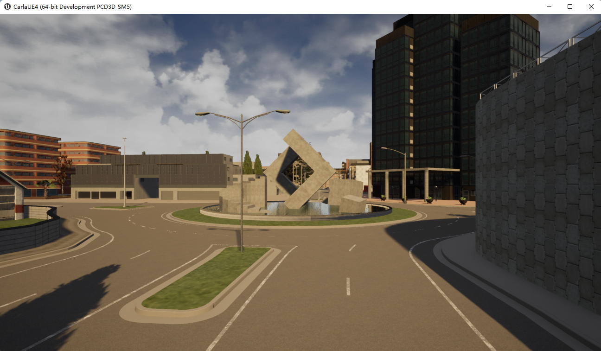
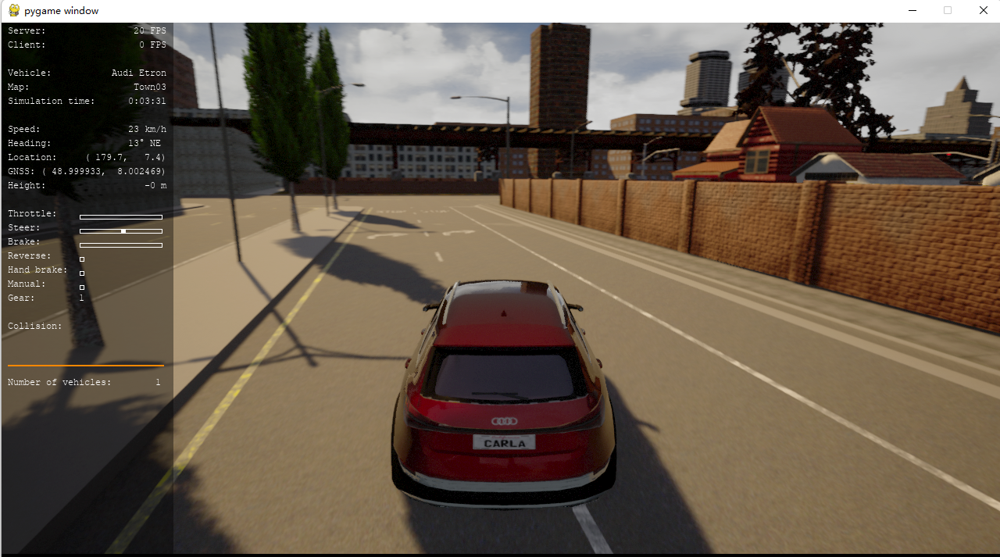
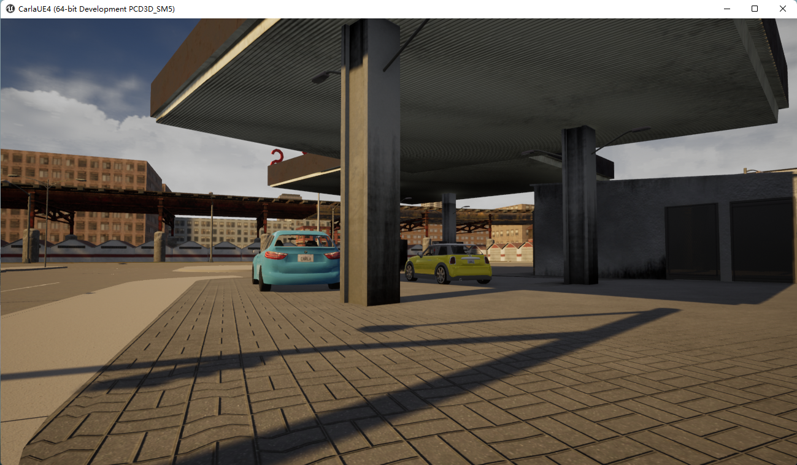
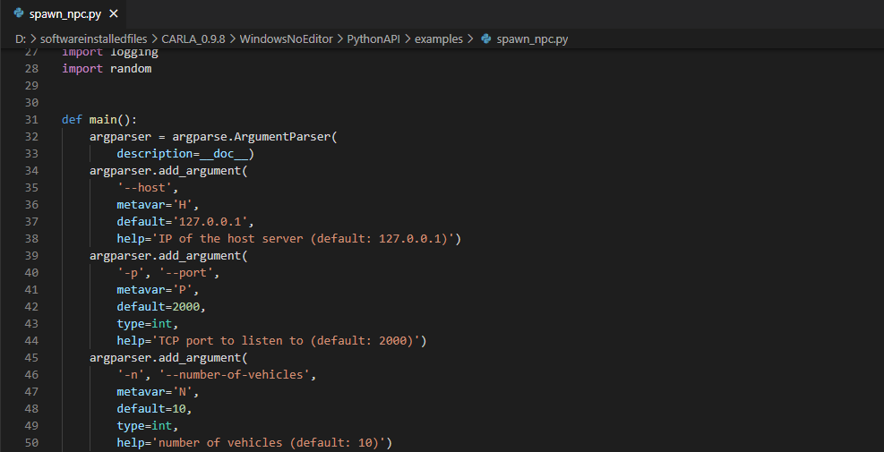
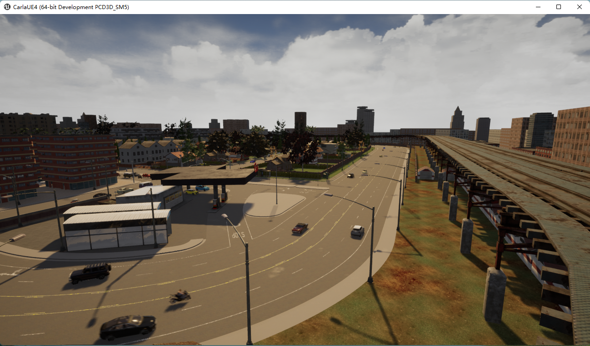
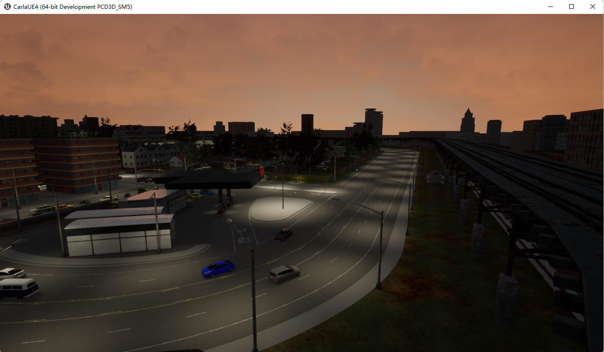
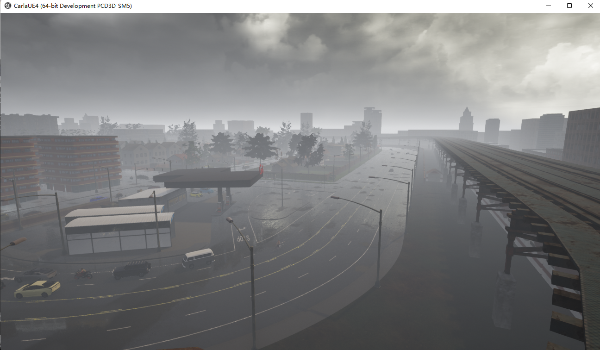

# install on windows

## 1. Introduction

CARLA has been developed from the ground up to support development, training, and validation of autonomous driving systems. In addition to open-source code and protocols, CARLA provides open digital assets (urban layouts, buildings, vehicles) that were created for this purpose and can be used freely. The simulation platform supports flexible specification of sensor suites, environmental conditions, full control of all static and dynamic actors, maps generation and much more.

## 2. Installation Carla 0.9.8

This guide shows how to download and install the packaged version of CARLA. The package includes the CARLA server and two options for the client library. There are additional assets that can be downloaded and imported into the package.

### 2.1 Before you begin

The following requirements should be fulfilled before installing CARLA:

[https://carla.readthedocs.io/en/0.9.8/start_quickstart/](https://carla.readthedocs.io/en/0.9.8/start_quickstart/)

The following requirements should be fulfilled before installing CARLA:

- **System requirements.** CARLA is built for Windows and Linux systems.
- **An adequate GPU.** CARLA aims for realistic simulations, so the server needs at least a 6 GB GPU although we would recommend 8 GB. A dedicated GPU is highly recommended for machine learning.
- **Disk space.** CARLA will use about 20 GB of space.
- **Python.** [Python](https://carla.readthedocs.io/en/latest/start_quickstart/(https://www.python.org/downloads/)) is the main scripting language in CARLA. CARLA supports Python 2.7 and Python 3 on Linux, and Python 3 on Windows.
- **Pip.** Some installation methods of the CARLA client library require **pip** or **pip3** (depending on your Python version) version 20.3 or higher.
- **Two TCP ports and good internet connection.** 2000 and 2001 by default. Make sure that these ports are not blocked by firewalls or any other applications.
- **Other requirements.** CARLA requires some Python dependencies. Install the dependencies according to your operating system.

```
pip3 install --user pygame numpy
```

### 2.2 CARLA installation

[https://carla.readthedocs.io/en/0.9.8/start_quickstart/](https://carla.readthedocs.io/en/0.9.8/start_quickstart/)

Now I just downloaded [https://carla-releases.s3.eu-west-3.amazonaws.com/Windows/CARLA_0.9.8.zip](https://carla-releases.s3.eu-west-3.amazonaws.com/Windows/CARLA_0.9.8.zip) in my windows system. 

Download and extract the release file. It contains a precompiled version of the simulator, the Python API module and some scripts to be used as examples.

### 2.3 Running CARLA

**Start CARLA server**

```
 cd D:\softwareinstalledfiles\CARLA_0.9.8\WindowsNoEditor\WindowsNoEditor
 
 CarlaUE4.exe
```



**Running CARLA Examples - automatic_control.py**

```
 cd D:\softwareinstalledfiles\CARLA_0.9.8\WindowsNoEditor\PythonAPI\examples

 python automatic_control.py
```



**Running CARLA Examples - spawn_npc.py**

```
 cd D:\softwareinstalledfiles\CARLA_0.9.8\WindowsNoEditor\PythonAPI\examples

 python spawn_npc.py
```



**Running CARLA Examples (add extra parameters) - spawn_npc.py** 

Open spawn_npc.py , you can find that we can add some extra parameters , for example, n , add specific vehicle numbers.



```
 cd D:\softwareinstalledfiles\CARLA_0.9.8\WindowsNoEditor\PythonAPI\examples

 python spawn_npc.py -n 150
```



**Running CARLA Examples - dynamic_weather.py** 

```
 cd D:\softwareinstalledfiles\CARLA_0.9.8\WindowsNoEditor\PythonAPI\examples

 python dynamic_weather.py
```






## 3. Reference

1. [https://carla.org/](https://carla.org/)
2. [https://carla.readthedocs.io/en/0.9.8/start_quickstart/](https://carla.readthedocs.io/en/0.9.8/start_quickstart/)
