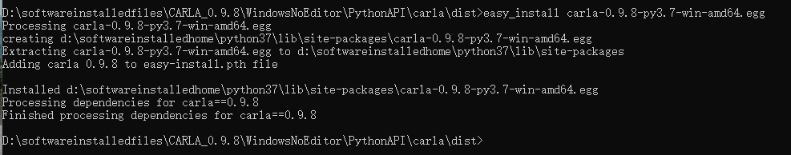
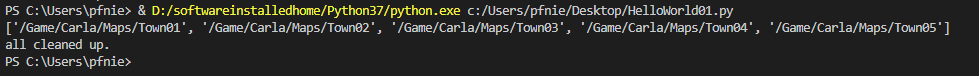

# hello world

## 1. Installed Carla Library into Python Environment

Even we can run examples code in Carla environment, and you can find some code recipe as below:

```
try:
    sys.path.append(glob.glob('../carla/dist/carla-*%d.%d-%s.egg' % (
        sys.version_info.major,
        sys.version_info.minor,
        'win-amd64' if os.name == 'nt' else 'linux-x86_64'))[0])
except IndexError:
    pass

import carla
```

This operation is not beautiful when you wanna code every time, it is easy to get the wrong path, so we need to do the following steps first:

```
easy_install carla-0.9.8-py3.7-win-amd64.egg
```



## 2. World and Client

### 2.1 Client

Two things are needed: The IP address identifying it and two TCP ports the client will be using to communicate with the server. And If you wanna more information about this, please access [https://carla.readthedocs.io/en/0.9.8/core_world/#client-creation](https://carla.readthedocs.io/en/0.9.8/core_world/#client-creation) .

```
client = carla.Client('localhost', 2000)
```

Once the client is created, set its time-out. This limits all networking operations so that these don't block forever the client but return an error instead if connection fails.

```
client.set_timeout(10.0) # seconds
```

### 2.2 World

Being the simulation running, a configured client can connect and retrieve the current world easily:

```
world = client.get_world()
```

The client can also get a list of available maps to change the current one. This will destroy the current world and create a new one.

```
maps = client.get_available_maps();
print(maps)
world = client.load_world('Town05')
```

### 2.3 Hello World Code

```
import carla


try: 
    client = carla.Client("localhost", 2000)
    client.set_timeout(10)
    world = client.get_world()
    maps = client.get_available_maps()
    print(maps)
    world = client.load_world('Town05')
    world = client.load_world('Town04')
    
finally:
    print("all cleaned up.")
```

## 3. Run Demonstration

### 3.1 Start Carla Server

Please double click CarlaUE4.exe to start Carla server.

### 3.2 Run Hello world



<video width="700" controls>
	<source src="/en/latest/_static/HelloWorld01.mp4" />
</video>

## 4. Reference

1. [https://carla.org/](https://carla.org/)
2. [https://carla.readthedocs.io/en/0.9.8/start_quickstart/](https://carla.readthedocs.io/en/0.9.8/start_quickstart/)
3. [https://carla.readthedocs.io/en/0.9.8/core_world/](https://carla.readthedocs.io/en/0.9.8/core_world/)
