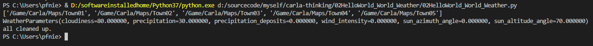

# hello world - weather

## 1. Weather

The weather is not a class on its own, but a world setting. However, there is a helper class named [carla.WeatherParameters](https://carla.readthedocs.io/en/0.9.8/python_api/#carla.WeatherParameters) that allows to define a series of visual characteristics such as sun orientation, cloudiness, lightning, wind and much more. The changes can then be applied using the world as the following example does:

```
weather = carla.WeatherParameters(
    cloudiness=80.0,
    precipitation=30.0,
    sun_altitude_angle=70.0)

world.set_weather(weather)

print(world.get_weather())
```

### 2.3 Hello World Code

```
import carla


try: 
    client = carla.Client("localhost", 2000)
    client.set_timeout(10)
    world = client.get_world()
    maps = client.get_available_maps()
    print(maps)
    world = client.load_world('Town05')
    world = client.load_world('Town04')
    
    weather = carla.WeatherParameters(
    cloudiness=80.0,
    precipitation=30.0,
    sun_altitude_angle=70.0)
    world.set_weather(weather)
    print(world.get_weather())
    
finally:
    print("all cleaned up.")
```

## 3. Run Demonstration

### 3.1 Start Carla Server

Please double click CarlaUE4.exe to start Carla server.

### 3.2 Run Hello World Weather



<video width="700" controls>
	<source src="/en/latest/_static/HelloWorld_Weather.mp4" />
</video>


## 4. Reference

1. [https://carla.org/](https://carla.org/)
2. [https://carla.readthedocs.io/en/0.9.8/start_quickstart/](https://carla.readthedocs.io/en/0.9.8/start_quickstart/)
3. [https://carla.readthedocs.io/en/0.9.8/core_world/](https://carla.readthedocs.io/en/0.9.8/core_world/)
4. [https://carla.readthedocs.io/en/0.9.8/core_world/#weather](https://carla.readthedocs.io/en/0.9.8/core_world/#weather)
